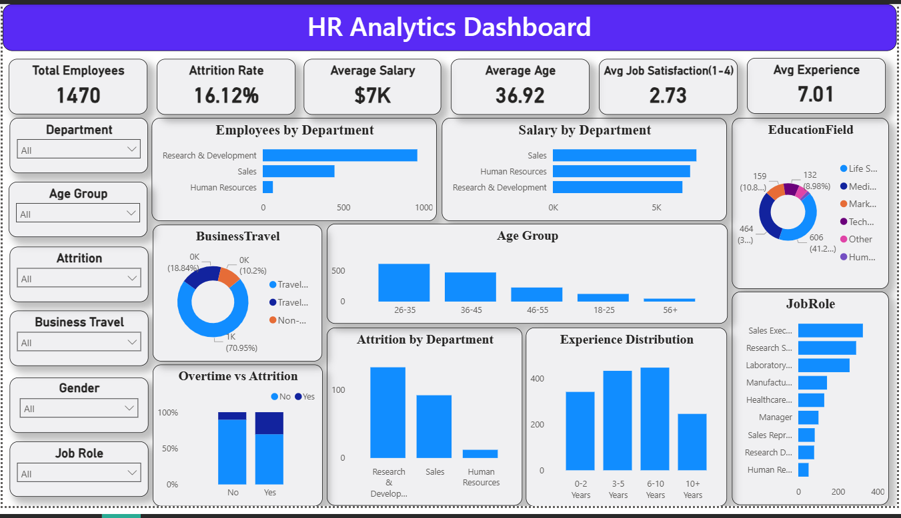

# HR Analytics Dashboard | SQL + Power BI


#  Project Overview

Employee attrition is one of the biggest challenges for HR departments. Losing experienced employees increases recruitment costs, reduces productivity, and affects organizational performance.

This project analyzes employee demographics, salary, job satisfaction, experience, overtime, business travel, and department-wise attrition to identify workforce trends and support data-driven HR decisions.

The project follows a complete analytics workflow:

**Raw CSV Dataset → SQL Data Cleaning & Analysis → Power BI Data Modeling → Interactive Dashboard → Business Insights**


# Project Objectives

* Analyze employee distribution across departments and job roles.
* Measure employee attrition and identify high-risk areas.
* Compare average salaries across departments.
* Understand workforce demographics (Age, Gender, Education).
* Analyze employee experience and job satisfaction.
* Study the impact of overtime and business travel on attrition.
* Build an interactive dashboard for HR decision-making.


# Tools & Technologies

| Tool              | Purpose                           |
| ----------------- | --------------------------------- |
| **MySQL (XAMPP)** | Data Cleaning & SQL Analysis      |
| **Power BI**      | Dashboard Development             |
| **Power Query**   | Data Transformation               |
| **DAX**           | KPI Measures & Calculated Columns |
| **GitHub**        | Project Version Control           |


# Dataset Information

**Dataset Name**

IBM HR Analytics Employee Attrition Dataset

### Dataset contains:

* Employee Demographics
* Salary Information
* Education Details
* Job Role
* Department
* Attrition Status
* Job Satisfaction
* Overtime
* Business Travel
* Years at Company

**Total Employees:** 1470


# SQL Data Cleaning Process

Before building the dashboard, the dataset was cleaned and validated using MySQL.

### Data Cleaning Steps

✅ Imported CSV dataset into MySQL

✅ Verified data types

✅ Checked for duplicate records

```sql
SELECT EmployeeNumber, COUNT(*)
FROM employee
GROUP BY EmployeeNumber
HAVING COUNT(*) > 1;
```

✅ Checked for NULL values

```sql
SELECT *
FROM employee
WHERE EmployeeNumber IS NULL;
```

✅ Verified Employee IDs

Ensured every employee has a unique Employee Number.


✅ Standardized categorical values

Verified consistency of values such as:

* Attrition
* Department
* Business Travel
* Gender
* Education Field


✅ Checked Salary values

Verified that Monthly Income contains no invalid or negative values.


✅ Verified numerical columns

Validated:

* Age
* YearsAtCompany
* JobSatisfaction
* MonthlyIncome

to ensure values were within expected ranges.


# SQL Analysis Performed

The following analyses were completed using SQL:

* Total Employees
* Attrition Count
* Attrition Rate
* Average Salary
* Average Age
* Average Experience
* Average Job Satisfaction
* Employees by Department
* Salary by Department
* Attrition by Department
* Education Field Distribution
* Business Travel Analysis
* Job Role Distribution
* Overtime vs Attrition
* Age Group Distribution
* Experience Distribution

All SQL queries are available in:

```text
SQL/analysis_queries.sql
```

#  Power BI Dashboard

The dashboard contains interactive slicers for:

* Department
* Age Group
* Attrition
* Business Travel
* Gender
* Job Role

### KPI Cards

*  Total Employees
*  Attrition Rate
*  Average Salary
*  Average Age
*  Average Job Satisfaction
*  Average Experience

### Visualizations

* Employees by Department
* Salary by Department
* Attrition by Department
* Education Field Distribution
* Business Travel Analysis
* Age Group Distribution
* Experience Distribution
* Overtime vs Attrition
* Job Role Distribution


#  Key Business Insights

###  Workforce Overview

* The organization consists of **1470 employees**.
* The average employee age is **36.92 years**.
* Employees have an average experience of **7 years**.


###  Attrition Analysis

* Overall attrition rate is **16.12%**.
* Research & Development has the largest workforce.
* Sales department experiences significant employee attrition.
* Employees working overtime are more likely to leave the organization.


### Salary Insights

* Average monthly salary is approximately **$6.5K**.
* Salary levels vary across departments, indicating differences in job roles and responsibilities.


### Education Insights

* Most employees belong to the **Life Sciences** education field.
* Technical and Marketing education fields have comparatively fewer employees.


### Workforce Demographics

* Employees aged **26–35 years** represent the largest age group.
* Most employees have **3–10 years** of company experience.
* Sales Executive is the most common job role.


# Business Story

Imagine you're the HR Manager of a growing organization.

Employee resignations have started increasing, but it's unclear **where**, **why**, and **which groups are most affected**.

Instead of manually reviewing thousands of employee records, this dashboard provides instant answers:

* Which department has the highest attrition?
* Are employees with overtime leaving more often?
* Which age groups make up the largest portion of the workforce?
* Which departments pay the highest average salaries?
* What is the overall employee experience level?

With these insights, HR leaders can make informed decisions on employee retention, workforce planning, compensation strategies, and organizational development.


#  Dashboard Preview




# Repository Structure

```text
HR-Analytics-Dashboard
│
├── Dashboard
│   └── HR_Analytics_Dashboard.pbix
│
├── Dataset
│   └── WA_Fn-UseC_-HR-Employee-Attrition.csv
│
├── Images
│   └── dashboard.png
│
├── SQL
│   ├── hr_analytics.sql
│   └── analysis_queries.sql
│
├── README.md
```


# How to Run the Project

1. Clone this repository.
2. Import the dataset into MySQL (optional if you want to reproduce the SQL analysis).
3. Run the queries from `SQL/analysis_queries.sql`.
4. Open `HR_Analytics_Dashboard.pbix` in Power BI Desktop.
5. Refresh the data if needed.
6. Explore the dashboard using the interactive slicers.


# Learning Outcomes

Through this project, I gained practical experience in:

* SQL data cleaning and validation
* Writing analytical SQL queries
* Data transformation using Power Query
* Creating calculated columns and measures with DAX
* Building interactive Power BI dashboards
* Designing KPI-driven reports
* Translating raw data into business insights

# About Me

**Amol Pandav**

MCA Student | Aspiring Data Analyst

**Skills:** SQL • Power BI • Python • Pandas • NumPy • Data Visualization • Data Cleaning • Business Analytics

📧 **Email:** pandavamol1621@example.com
🔗 **LinkedIn:** https://www.linkedin.com/in/amol-pandav
💻 **GitHub:** https://github.com/amol1621

## ⭐ If you found this project useful, consider giving it a star!
